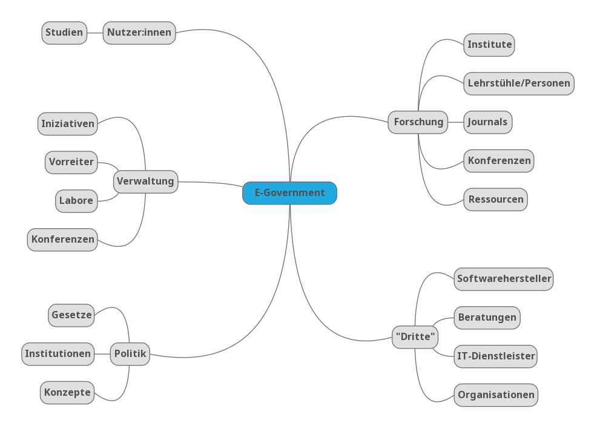

Eine Sammlung von Ressourcen, Übersichten und Links zum Thema E-Government in Deutschland

## Übersicht

Hier geht's zu den einzelnen Aspekten:

* [Nutzer:innen](nutzerinnen.html)
* [Verwaltung](verwaltung.html)
* [Politik](politik.html)
* [Forschung](forschung.html)
* ["Dritte"](dritte.html)

## Ressourcen

* [eGovernment-Podcast](https://egovernment-podcast.com/)

